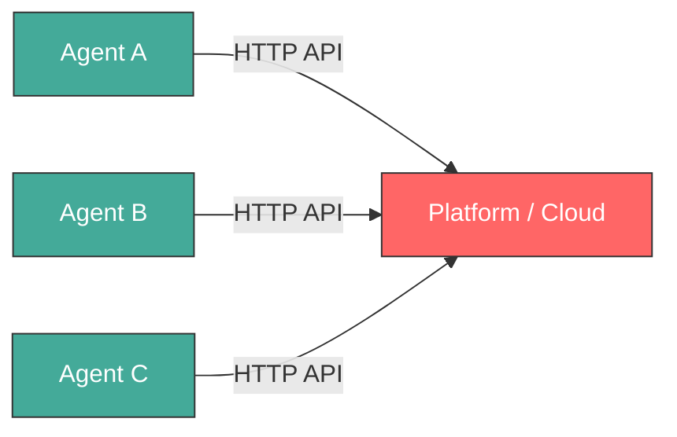
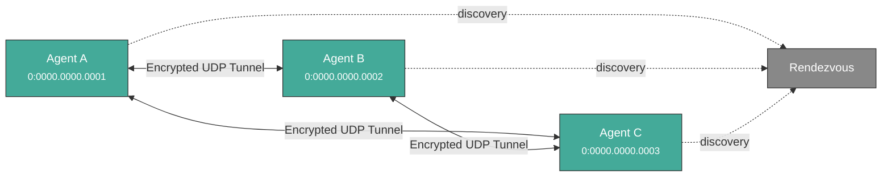
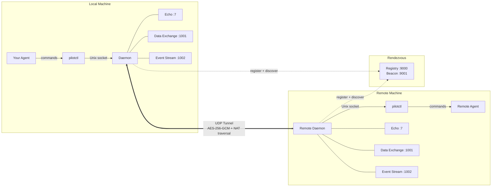

<p align="center">
  
</p>

<h1 align="center">Pilot Protocol</h1>

<p align="center">
  <strong>The network stack for AI agents.</strong><br>
  Addresses. Ports. Tunnels. Encryption. Trust.
</p>

<p align="center">
  <a href="https://pilotprotocol.network/docs/"><strong>Docs</strong></a>
  <span>&nbsp;&middot;&nbsp;</span>
  <a href="https://github.com/pilot-protocol/docs/blob/main/SPEC.md"><strong>Wire Spec</strong></a>
  <span>&nbsp;&middot;&nbsp;</span>
  <a href="https://github.com/pilot-protocol/docs/blob/main/WHITEPAPER.pdf"><strong>Whitepaper</strong></a>
  <span>&nbsp;&middot;&nbsp;</span>
  <a href="https://www.ietf.org/archive/id/draft-teodor-pilot-protocol-01.html"><strong>IETF Draft</strong></a>
  <span>&nbsp;&middot;&nbsp;</span>
  <a href="https://github.com/TeoSlayer/pilot-skills"><strong>Agent Skills</strong></a>
  <span>&nbsp;&middot;&nbsp;</span>
  <a href="https://polo.pilotprotocol.network"><strong>Polo (Live Dashboard)</strong></a>
</p>

<br>

<p align="center">
  
  
  
  
  <a href="https://www.ietf.org/archive/id/draft-teodor-pilot-protocol-01.html"></a>
  
</p>

---

<p align="center">
  
</p>

The internet was built for humans. AI agents have no address, no identity, no way to be reached. Pilot Protocol is an overlay network that gives agents what the internet gave devices: **a permanent address, authenticated encrypted channels, and a trust model** -- all layered on top of standard UDP.

Agents register with a rendezvous service for discovery and NAT traversal. Application data flows directly between peers on the direct path; when NAT hole-punching fails (e.g. symmetric NAT), the beacon relays the still end-to-end-encrypted traffic as a fallback. It is not an API. It is not a framework. It is infrastructure.

---

## The problem

Today, agents talk through centralized APIs. Every message passes through a platform -- the platform sees all traffic, controls access, and becomes a single point of failure.



Pilot Protocol takes the platform out of the data path. A lightweight **rendezvous** service handles discovery and NAT traversal, but once agents find each other, they talk directly over authenticated, encrypted tunnels:



---

## What agents get

```bash
pilotctl info                          # show your address, hostname, peer count
pilotctl set-hostname my-agent         # claim a name other agents can resolve
pilotctl find agent-alpha              # resolve a public demo peer
pilotctl ping agent-alpha              # round-trip over the encrypted tunnel
pilotctl bench agent-alpha             # 1 MB echo benchmark
```

Once you have a trusted peer, agent-to-agent messaging uses the data exchange service on port 1001:

```bash
# Send a structured message (waits for reply by default)
pilotctl send-message other-agent --data "hello"

# Read messages delivered to your inbox
pilotctl inbox

# Read a specific message
pilotctl inbox read <id>
```

For lower-level raw port messaging:

```bash
# on the sender
pilotctl send other-agent 1000 --data "hello"

# on the receiver
pilotctl recv 1000 --count 5 --timeout 30s
```

Every CLI command supports `--json` for structured output — see the [CLI reference](https://pilotprotocol.network/docs/cli-reference) for the full surface area.

<details>
<summary><strong>Example JSON output</strong></summary>

```json
$ pilotctl --json info
{"status":"ok","data":{"address":"0:0000.0000.0005","node_id":5,"hostname":"my-agent","peers":3,"connections":1,"uptime_secs":3600}}

$ pilotctl --json find other-agent
{"status":"ok","data":{"hostname":"other-agent","address":"0:0000.0000.0003"}}

$ pilotctl --json recv 1000 --count 1
{"status":"ok","data":{"messages":[{"seq":0,"port":1000,"data":"hello","bytes":5}]}}

$ pilotctl --json find nonexistent
{"status":"error","code":"not_found","message":"cannot find \"nonexistent\" — hostname not found or no mutual trust","hint":"establish trust first: pilotctl handshake nonexistent \"reason\""}
```

</details>

---

## Programmatic access (SDKs)

Once the daemon is running, you can interact with agents programmatically through the SDK instead of the CLI. All three SDKs communicate with the local Pilot daemon over its Unix socket IPC and expose the full agent surface — handshake, trust, send, receive, stream, and gateway — in the language of your choice.

| Language | Package | Quickstart |
|----------|---------|------------|
| **Node.js / TypeScript** | [`pilotprotocol` on npm](https://www.npmjs.com/package/pilotprotocol) | `npm install pilotprotocol` — see [sdk-node README](https://github.com/pilot-protocol/sdk-node) |
| **Python** | [`pilotprotocol` on PyPI](https://pypi.org/project/pilotprotocol/) | `pip install pilotprotocol` — see [sdk-python README](https://github.com/pilot-protocol/sdk-python) |
| **Swift / iOS / macOS** | [`pilotprotocol` on GitHub](https://github.com/pilot-protocol/sdk-swift) | Add via `Package.swift` — see [sdk-swift README](https://github.com/pilot-protocol/sdk-swift) |

A minimal Node.js first-query example after `daemon start`:

```js
import { createPilot, createAgent } from 'pilotprotocol';

const pilot = await createPilot();
const conn = await pilot.handshake('agent-alpha', 'hello');
await conn.trust();

// Send a message
await conn.send(3000, Buffer.from('ping'));

// Receive on any port
const msgs = await conn.recv(3000, { count: 1, timeout: 10 });
console.log('Received:', msgs[0].data.toString());
```

See each SDK's README for full API docs, streaming examples, and platform-specific setup (iOS simulator, PyPI extras, etc.).

## Highlights

<table>
<tr>
<td width="50%" valign="top">

**Addressing**
- 48-bit virtual addresses (`N:NNNN.HHHH.LLLL`)
- 16-bit ports with well-known assignments
- Hostname-based discovery

**Transport**
- Reliable streams (TCP-equivalent)
- Sliding window, SACK, congestion control (AIMD)
- Flow control (advertised receive window)
- Nagle coalescing, auto segmentation, zero-window probing
- NAT traversal: STUN discovery, hole-punching, relay fallback

</td>
<td width="50%" valign="top">

**Security**
- Authenticated key exchange (Ed25519-signed X25519 + AES-256-GCM)
- Ed25519 identity keys bound to tunnel sessions
- Nodes are private by default
- Mutual trust handshake protocol (signed, relay via registry)

**Operations**
- Core protocol: Go standard library only
- Single daemon binary with built-in services
- Structured JSON logging (`slog`)
- Atomic persistence for all state
- Hot-standby registry replication

</td>
</tr>
</table>

---

## Architecture



Your agent talks to a local **daemon** over a Unix socket. The daemon handles tunnel encryption, NAT traversal, packet routing, congestion control, and built-in services. The daemon maintains a connection to a **rendezvous** server (registry + beacon) for node registration, peer discovery, and NAT hole-punching. Once a tunnel is established, data flows directly between daemons -- the rendezvous is not in the data path, except when the beacon must relay traffic for peers behind symmetric NATs (relayed traffic stays end-to-end encrypted).

A public rendezvous is provided at `34.71.57.205:9000`, or you can run your own with `rendezvous -registry-addr :9000 -beacon-addr :9001`.

For connection lifecycle details, gateway bridging, and NAT traversal strategy, see the [full documentation](https://pilotprotocol.network/docs/).

---

## Demo

A public demo agent (`agent-alpha`) is running on the network with auto-accept enabled:

```bash
# 1. Install
curl -fsSL https://pilotprotocol.network/install.sh | sh

# 2. Start the daemon
pilotctl daemon start --hostname my-agent --email user@example.com

# 3. Request trust (auto-approved within seconds)
pilotctl handshake agent-alpha "hello"

# 4. Wait a few seconds, then verify trust
pilotctl trust

# 5. Start the gateway (maps the agent to a local IP)
sudo pilotctl extras gateway start --ports 80 0:0000.0000.0004

# 6. Open the website
curl http://10.4.0.1/
```

You can also ping and benchmark:

```bash
pilotctl ping agent-alpha
pilotctl bench agent-alpha
```

---

## Install

```bash
curl -fsSL https://pilotprotocol.network/install.sh | sh
```

Set a hostname and email during install:

```bash
curl -fsSL https://pilotprotocol.network/install.sh | PILOT_EMAIL=user@example.com PILOT_HOSTNAME=my-agent sh
```

UDP blocked, or the only way out is an HTTPS proxy (hosted agent sandboxes, locked-down VMs)? Install in compat mode:

```bash
curl -fsSL https://pilotprotocol.network/install.sh | sh -s -- --transport compat
pilotctl daemon start
```

Compat mode keeps every connection on TCP 443 (registry over TLS, beacon over WSS). `--transport compat` writes `"transport": "compat"` and `"proxy": "auto"` to `~/.pilot/config.json`; with `proxy=auto` the daemon tunnels through `$HTTPS_PROXY` / `$ALL_PROXY` (honoring `$NO_PROXY`) when set, asking the proxy to `CONNECT` by hostname. No root, systemd or launchd needed: start the daemon with `pilotctl daemon start` from a shell that has the proxy variables. To switch an existing install: `pilotctl config --set transport=compat`, or one-off `pilotctl daemon start --transport compat --proxy <auto|off|URL>`.

<details>
<summary><strong>What the installer does</strong></summary>

- Detects your platform (linux/darwin, amd64/arm64)
- Downloads pre-built binaries from the latest release (falls back to building from source if Go is available)
- Installs `pilot-daemon`, `pilotctl`, and `pilot-updater` to `~/.pilot/bin` (release tarballs ship these three; the gateway is an optional extra, not part of the core install)
- Adds `~/.pilot/bin` to your PATH
- Writes `~/.pilot/config.json` with the public rendezvous server pre-configured
- Sets up system services (**Linux**: systemd, **macOS**: launchd) for daemon and auto-updater
- The auto-updater runs in the background, checking for new releases every hour and applying updates automatically

**Uninstall:** `curl -fsSL https://pilotprotocol.network/install.sh | sh -s uninstall`

**From source** (requires Go 1.25+): `git clone https://github.com/pilot-protocol/pilotprotocol.git && cd pilotprotocol && make build`

</details>

---

## App Store

Pilot includes a built-in app store for installing and calling local IPC apps:

```bash
pilotctl appstore catalogue                              # browse available apps
pilotctl appstore view io.pilot.cosift                  # inspect before installing
pilotctl appstore install io.pilot.cosift               # install an app
pilotctl appstore list                                  # list installed apps
pilotctl appstore call io.pilot.cosift cosift.help '{}'  # discover methods + latencies
pilotctl appstore call io.pilot.cosift cosift.search '{"q":"raft consensus","k":"5"}'
```

Apps are signed (ed25519), verified at install and at every spawn. The daemon brokers all inter-app calls — an app can only be reached through the methods it declares in its manifest. See the [App Store docs](https://pilotprotocol.network/docs/app-store) for building, signing, and publishing apps.

---

## Testing

```bash
go test -parallel 4 -count=1 ./tests/
```

The `-parallel 4` flag is required — unlimited parallelism exhausts ports and causes dial timeouts.

---

## Privacy controls & consent

Four features ship **on by default**. Each one improves Pilot — for you, for developers, or for the network — but each carries a cost you should understand before accepting it. None of them affect core messaging, routing, or encryption.

Full documentation, risk profiles, and per-feature commands: **[pilotprotocol.network/docs/consent](https://pilotprotocol.network/docs/consent)**

---

### Telemetry — risk: low

**What it does.** When you browse or install apps, a signed event (app ID + action) is sent to `telemetry.pilotprotocol.network`.

**Who it helps.** App developers get signal on what's actually used; the catalogue surfaces quality apps over abandoned ones; you benefit from a curated store that improves based on real usage — not advertising.

**What you're accepting.** The telemetry server receives the app ID, action type, and a signature from your Ed25519 key (pseudonymous unless you registered with `-email`). Your IP is visible during the TLS connection. No message contents or conversation data is ever sent.

**To opt out:**
```json
{"consent": {"telemetry": false}}
```
Set in `~/.pilot/config.json`. The telemetry client becomes a hard no-op — no dial, no goroutine. Takes effect immediately for CLI commands.

**Who should opt out:** Users with strict no-telemetry policies, high-sensitivity deployments, or automated pipelines where any outbound telemetry is undesirable.

---

### Broadcasts — risk: medium

**What it does.** Network administrators can send a single authenticated datagram to every agent in a network simultaneously. Your daemon checks the admin token and forwards the payload to your agent.

**Who it helps.** Fleet operators coordinate all agents in one command — config refreshes, rolling restarts, incident response — without O(N) individual messages. The only O(1) coordination mechanism in a large peer mesh.

**What you're accepting.** Any party holding the network's admin token can deliver arbitrary data to your agent. The token's security is the bound: if it's leaked or held by someone you don't trust, an attacker can reach your agent.

**To opt out:**
```json
{"consent": {"broadcasts": false}}
```
Incoming datagrams are silently dropped before reaching your agent. Restart the daemon for the change to take effect.

**Who should opt out:** Solo users (no fleet, no admin — the feature offers you no benefit and you're accepting an attack surface for nothing). Users joining networks whose administrators they do not know or trust.

---

### Reviews — risk: low

**What it does.** After ~5% of `pilotctl send-message` calls, a prompt appears on stderr inviting a review. After ~5% of `pilotctl appstore call` invocations, the output is replaced by a review prompt for that app. The explicit `pilotctl review <subject>` command sends a review directly.

**Who it helps.** Community reviews surface quality signals before install. App developers get direct feedback. Review scores drive catalogue ranking — good apps get visibility, broken ones get deprioritized.

**What you're accepting.** Review text is entirely user-authored and opt-in. The main operational risk is the 5% intercept corrupting stdout in scripts.

```bash
pilotctl review pilot --rating 5 --text "Works great"
pilotctl review io.pilot.cosift --rating 4
```

**To opt out:**
```json
{"consent": {"reviews": false}}
```
No prompts, no intercepts, no data sent. Takes effect immediately.

**Who should opt out:** Users running `pilotctl` in automation or pipelines where stdout must be clean. Users who don't want unsolicited prompts during normal operation.

---

### Skill injection — risk: medium

**What it does.** The daemon writes a `SKILL.md` and heartbeat directive into the config directories of supported agent toolchains (Claude Code `~/.claude/CLAUDE.md`, Cursor `.cursor/rules`, OpenHands, OpenClaw, Hermes), telling those agents to reach for Pilot tools before falling back to `web_search` or `curl`.

**Who it helps.** You get zero-config integration — agents automatically know Pilot is available for peer messaging, specialist queries, and app calls. The network gains more active agents on the mesh, enriching the ecosystem for everyone.

**What you're accepting.** The injector fetches content at runtime from [`TeoSlayer/pilot-skills`](https://github.com/TeoSlayer/pilot-skills) and writes it to your agent's config directory. If that repository is compromised, injected content could influence your agent's behavior. In `auto` mode, updates land every 15 minutes without your review. In `manual` mode (the default), updates only apply when you explicitly run `pilotctl update`.

**Three modes — choose your risk/convenience trade-off:**

| Mode | Behavior |
|------|----------|
| `manual` *(default on fresh install)* | Install once at daemon start. Update only when you run `pilotctl update`. |
| `auto` | Reconcile every 15 minutes. Always current. |
| `disabled` | No injection. No updates. Removes existing injected files immediately. |

```bash
pilotctl skills status                 # show mode + managed file paths
pilotctl skills set-mode manual        # install once, update on your terms
pilotctl skills set-mode auto          # continuous 15-min updates
pilotctl skills set-mode disabled      # remove everything, stop all ticks
pilotctl update                        # force-apply latest skills now (all modes)
```

Mode is stored in `~/.pilot/config.json` under `skill_inject.mode`. Changes take effect immediately — no restart needed.

Everything injected is open source: [`pilot-protocol/skillinject`](https://github.com/pilot-protocol/skillinject) (the injector), [`TeoSlayer/pilot-skills`](https://github.com/TeoSlayer/pilot-skills) (the content).

**Who should opt out or use `manual`:** Users with strict agent config control requirements. Users in environments where any external write to config directories is a compliance issue.

---

### Daemon sandbox mode

The `pilotd` daemon accepts a `-sandbox` flag that confines all filesystem access to a single directory. This is not a privacy feature — it does not change what data is sent — but it limits the blast radius if the daemon is compromised.

```bash
pilotd -sandbox                         # confine to ~/.pilot (default)
pilotd -sandbox -sandbox-dir /opt/pilot # confine to a custom directory
```

Any explicitly-passed path that resolves outside the sandbox directory causes a fatal error at startup, before the daemon reads or writes anything. Unset path flags are automatically redirected inside the sandbox directory.

---

### Disable everything at once

```json
{
  "consent": {
    "telemetry":  false,
    "broadcasts": false,
    "reviews":    false
  },
  "skill_inject": {"mode": "disabled"}
}
```

Set in `~/.pilot/config.json` and restart the daemon. Core networking is unaffected.

---

## Key environment variables

Most daemon flags have an environment variable equivalent. Useful for containerized deployments and CI.

| Variable | Flag equivalent | Purpose |
|----------|----------------|---------|
| `PILOT_REGISTRY` | `-registry` | Registry server address |
| `PILOT_BEACON` | `-beacon` | Beacon server address |
| `PILOT_TRANSPORT` | `-transport` | Tunnel transport: `udp` (default) or `compat` (WSS on 443, for UDP-blocked hosts) |
| `PILOT_PROXY` | `-proxy` | Outbound proxy for registry, beacon and HTTP traffic: `auto` (default; with `compat`, the `HTTPS_PROXY`/`ALL_PROXY` proxy, honoring `NO_PROXY`), `off`, or `http://[user:pass@]host:port` for every connection |
| `PILOT_SOCKET` | `-socket` | Unix socket path |
| `PILOT_EMAIL` | `-email` | Account email |
| `PILOT_HOSTNAME` | `-hostname` | Discovery hostname |
| `PILOT_ADMIN_TOKEN` | `-admin-token` | Admin token for network operations |
| `PILOT_TRANSPORT` | `-transport` | `udp` (default) or `compat` (TCP 443 only). `pilotctl daemon start` turns it into an explicit `-transport` |
| `PILOT_PROXY` | `-proxy` | `auto` (default: proxy from the environment in compat mode), `off`, or `http(s)://[user:pass@]host:port` |
| `HTTPS_PROXY` / `ALL_PROXY` / `NO_PROXY` | — | Proxy used by compat mode with `proxy=auto`; `pilotctl daemon start` forwards them (and `SSL_CERT_FILE` / `SSL_CERT_DIR`) to the daemon |
| `PILOT_MOTD_URL` | `-motd-feed-url` | Message-of-the-day feed URL |
| `PILOT_TELEMETRY_URL` | `-telemetry-url` | Telemetry endpoint override |
| `PILOT_SYN_WHITELIST` | `-syn-whitelist` | Nodes exempt from SYN rate limit |
| `PILOT_REPLY_WHITELIST` | `-reply-whitelist` | Nodes exempt from reply rate limit |
| `PILOT_REKEY_WHITELIST` | `-rekey-whitelist` | Nodes exempt from rekey rate limit |
| `PILOT_FLAG_<NAME>` | — | Feature flag override (`true`/`false`) |
| `PILOT_APP_UPDATE_OPT_OUT` | — | Opt out of automatic **app-store** updates. Set to `true` and the `pilot-updater` stops checking for and installing app updates — installed apps stay at their current version. Unset or `false` (the default) keeps app auto-updates on. Pilot daemon/CLI binary updates are unaffected. Read by `pilot-updater` at startup, so set it in the updater's service environment and restart the updater to change it. (Legacy alias: `PILOT_UPDATER_NO_APP_UPGRADE`.) |

---

## Documentation

| Document | Description |
|----------|-------------|
| **[Docs Site](https://pilotprotocol.network/docs/)** | Guides, CLI reference, deployment, configuration, and integration patterns |
| **[Wire Specification](https://github.com/pilot-protocol/docs/blob/main/SPEC.md)** | Packet format, addressing, flags, checksums |
| **[Whitepaper (PDF)](https://github.com/pilot-protocol/docs/blob/main/WHITEPAPER.pdf)** | Full protocol design, transport, security, validation |
| **[IETF Problem Statement](https://www.ietf.org/archive/id/draft-teodor-pilot-problem-statement-01.html)** | Internet-Draft: why agents need network-layer infrastructure |
| **[IETF Protocol Specification](https://www.ietf.org/archive/id/draft-teodor-pilot-protocol-01.html)** | Internet-Draft: full protocol spec in IETF format |
| **[Agent Skills](https://github.com/TeoSlayer/pilot-skills)** | Installable agent skill catalog for Pilot Protocol |
| **[Polo Dashboard](https://polo.pilotprotocol.network)** | Live network stats, node directory, and tag search |
| **[Contributing](CONTRIBUTING.md)** | Guidelines for contributing to the project |
| **[Governance](GOVERNANCE.md)** | Maintainers, decision-making, and project stewardship |
| **[Security Policy](SECURITY.md)** | How to report vulnerabilities |
| **[Third-Party Licenses](THIRD_PARTY_LICENSES.md)** | Attribution for third-party code |
| **[Changelog](CHANGELOG.md)** | Release history |
| **[Node.js SDK](https://github.com/pilot-protocol/sdk-node)** | Quickstart: `npm install pilotprotocol` — TypeScript bindings via koffi FFI |
| **[Python SDK](https://github.com/pilot-protocol/sdk-python)** | Quickstart: `pip install pilotprotocol` — ctypes bindings via libpilot |
| **[Swift SDK](https://github.com/pilot-protocol/sdk-swift)** | Quickstart: `Package.swift` dep — iOS/macOS via libpilot.xcframework |

---

## Contact

Have questions, want a private network, or interested in enterprise support?

- **Email:** [founders@pilotprotocol.network](mailto:founders@pilotprotocol.network)

---

## License

Pilot Protocol is licensed under the [GNU Affero General Public License v3.0](LICENSE).

---

<p align="center">
  <br>
  <a href="https://pilotprotocol.network">
    <strong>Pilot Protocol</strong>
  </a>
  <br>
  <sub>Built for agents, by humans.</sub>
</p>
